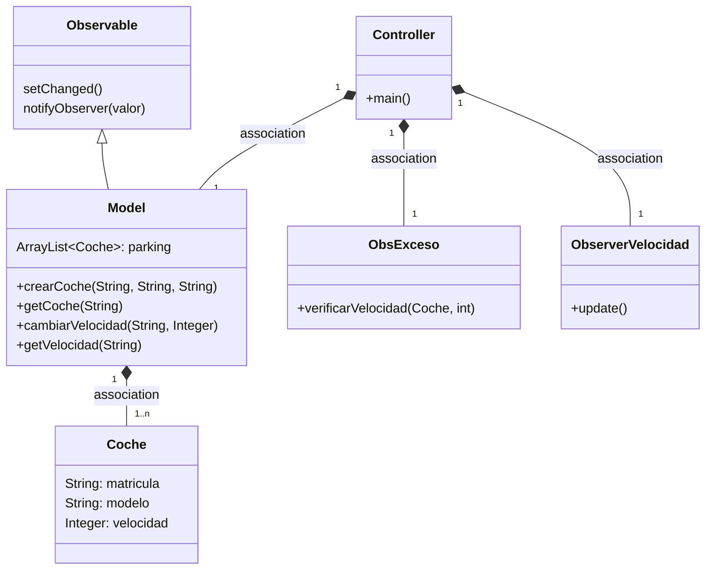
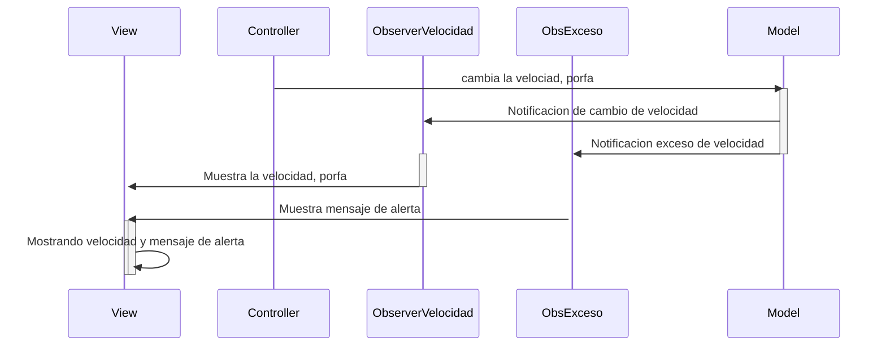

# Arquitectura MVC con Observer

En esta rama utilizaremos el patrón Observer

Los cambios de la velocidad que se hagan en el model
serán observados por el Controller

Para notificar a los observadores hacemos dos pasos

* Actualizamos el estado a 'algo a cambiado' con `setChanged()`
* Notificamos a los observadores `notifyObservers(valor)`

De esta manera se *dispara* en todos los observadores el método `update()`

## Clase ObsExceso

No siempre es necesario implementar la interfaz o usar el método addObserver(), depende mucho del contexto
y la situación en el que lo estemos utilizando, en este caso lo que hacemos es configurarlo
de forma directa al objeto observado.
He tenido que utilizarlo de esta forma ya que no he podido solucionar algunos problemas que me da el IDE, al implementar la interfaz
'Observer' y la clase 'Observable' me aparece tachado por estar obsoleto, por lo tanto, no puedo utilizar el método addObserver().
Para hacer de esa forma lo que tendría que hacer sería, en la clase ObsExceso implementar Observer y en la clase Model, extender 'Observable',
luego en mi clase Controller, instaciar un objeto de la clase Model ya que es observable y añadirle con el método
addObserver() un nuevo observador, que su función es ver que, en este caso un coche, supera los 120km/hr.
---
## Diagrama de clases:

---

## Diagrama de Secuencia

Que ocurre cuando se cambia la velocidad

---
## Pasos para la configuración

1. Model
    * Extender `Observable` en `Model`
    * En el método en donde ocurra el cambio:
        * setChenged()
        * notifyObserver(valor)
2. Crear una clase que sea el observador, que implementa la interface `Observer`
    * definir el método `update()`
3. Controller
    * Instanciar el observer, definido en el punto anterior
    * Añadir este observer al observable con `addObserver()`
